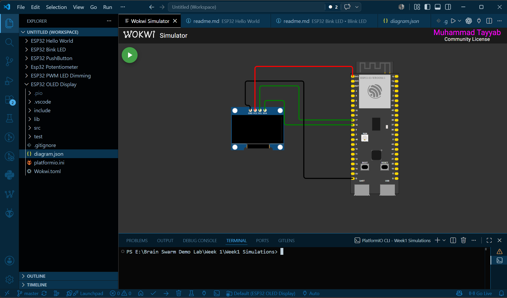
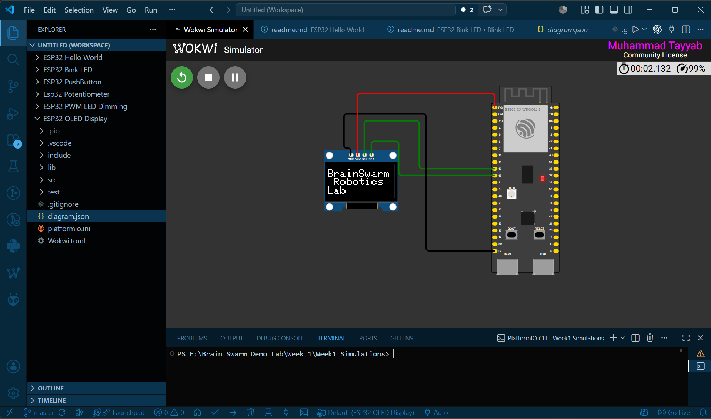

# ESP32 OLED Display

This project demonstrates how to interface a **0.96-inch SSD1306 OLED Display** with an ESP32 using the **I²C communication protocol**. The ESP32 displays text on the OLED screen, making it useful for showing sensor readings, system status, menus, and debugging information.

---

## Components Required

- ESP32 Development Board
- 0.96" SSD1306 OLED Display (128×64)
- Jumper Wires
- Wokwi Simulator
- PlatformIO

---


---

## Concepts

### OLED Display

OLED (Organic Light Emitting Diode) displays produce light from each individual pixel, so they do not require a backlight. They provide high contrast, low power consumption, and clear text, making them ideal for embedded systems.

---

### I²C Communication

I²C (Inter-Integrated Circuit) is a two-wire communication protocol used to connect multiple devices.

It consists of:

- **SDA (Serial Data)** – Transfers data
- **SCL (Serial Clock)** – Synchronizes communication

The ESP32 acts as the **Master**, while the OLED acts as the **Slave**.

---

### I²C Address

Each I²C device has a unique address.

Most SSD1306 OLED displays use:

```cpp
0x3C
```

This address allows the ESP32 to communicate with the display.

---

### `Wire` Library

The `Wire` library enables I²C communication.

```cpp
Wire.begin(SDA, SCL);
```

It initializes the I²C bus using the specified SDA and SCL pins.

---

### Adafruit SSD1306 Library

The Adafruit SSD1306 library provides functions to control the OLED display without handling low-level communication.

Common functions include:

```cpp
display.begin();
display.clearDisplay();
display.setCursor();
display.print();
display.display();
```

---

### `display.display()`

The OLED uses an internal memory buffer.

Functions like `print()` only write to the buffer.

```cpp
display.display();
```

This sends the buffer to the OLED so the new content becomes visible.

---

## Steps

1. Open the project in VS Code.
2. Build the project using PlatformIO.
3. Start the Wokwi simulation.
4. The ESP32 initializes the OLED display.
5. Text appears on the OLED screen.

---

## Expected Output

### Circuit Diagram



### Simulation Output



The OLED successfully displays the programmed text while the ESP32 runs normally.

---

## Project Structure

```
ESP32 OLED Display/
├── src/
│   └── main.cpp
├── platformio.ini
├── diagram.json
├── wokwi.toml
├── ScreenShots
└── README.md
```

---

## Learning Outcomes

After completing this project, you will understand:

- What an OLED display is
- How I²C communication works
- The purpose of SDA and SCL pins
- How to initialize an SSD1306 OLED
- How to display text on the screen
- The role of the display buffer
- How to simulate OLED projects using Wokwi

---

## Author

**Muhammad Tayyab**  