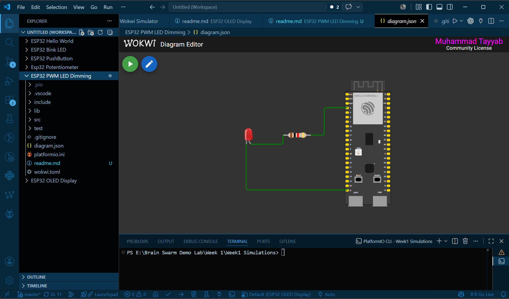
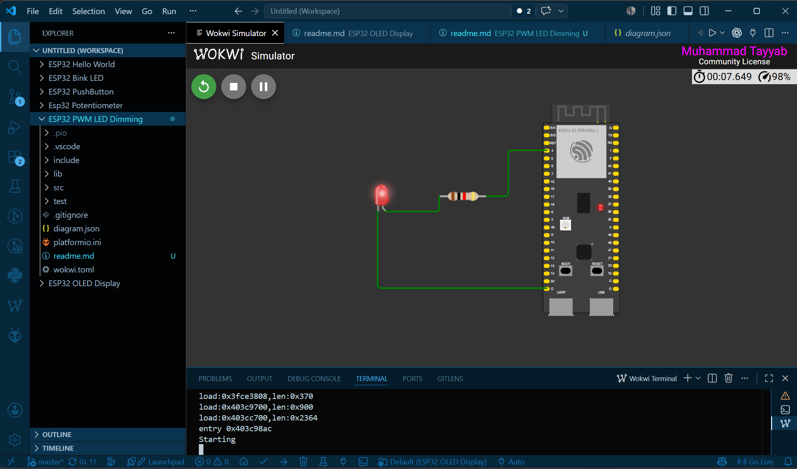

# ESP32 PWM LED Dimming

This project demonstrates how to control the brightness of an LED using **Pulse Width Modulation (PWM)** on the ESP32. The LED gradually fades in and fades out by changing the PWM duty cycle, creating a smooth dimming effect.

---

## Components Required

- ESP32 Development Board
- LED
- 220Ω Resistor
- Jumper Wires
- Wokwi Simulator
- PlatformIO

---

## Circuit Diagram


---

## Concepts

### PWM (Pulse Width Modulation)

PWM is a technique used to simulate analog output using a digital pin. Instead of changing the voltage, the ESP32 rapidly switches the pin **ON** and **OFF**. The ratio of ON time to OFF time determines the average power delivered to the LED.

- Low Duty Cycle → Dim LED
- High Duty Cycle → Bright LED
- 100% Duty Cycle → LED Fully ON

---

### PWM Channel

The ESP32 supports multiple PWM channels. Each channel can be configured with its own frequency and resolution.

```cpp
ledcSetup(channel, frequency, resolution);
```

Example:

```cpp
ledcSetup(0, 5000, 8);
```

- Channel = 0
- Frequency = 5000 Hz
- Resolution = 8 bits

---

### PWM Frequency

Frequency specifies how many times the PWM signal repeats every second.

```cpp
5000 Hz
```

A frequency of **5000 Hz** means the signal switches ON and OFF **5000 times per second**, making the blinking invisible to the human eye.

---

### PWM Resolution

Resolution determines how many brightness levels are available.

For an **8-bit** resolution:

```
0 → LED OFF
255 → Maximum Brightness
```

This provides **256 brightness levels (0–255).**

---

### `ledcAttachPin()`

This function connects a GPIO pin to a PWM channel.

```cpp
ledcAttachPin(4, 0);
```

This attaches **GPIO 4** to **PWM Channel 0**.

---

### `ledcWrite()`

The `ledcWrite()` function sets the PWM duty cycle.

```cpp
ledcWrite(0, brightness);
```

A small value produces a dim LED, while a larger value increases the brightness.

---

## Steps

1. Open the project in VS Code.
2. Build the project using PlatformIO.
3. Start the Wokwi simulation.
4. Observe the LED gradually increasing and decreasing in brightness.
5. Open the Serial Monitor if debugging messages are enabled.

---

## Expected Output

### Circuit Diagram



### Simulation Output



The LED continuously:

- Fades from OFF to full brightness.
- Fades from full brightness back to OFF.
- Repeats the process indefinitely.

---

## Project Structure

```
ESP32 PWM LED Dimming/
├── src/
│   └── main.cpp
├── platformio.ini
├── diagram.json
├── wokwi.toml
├── images/
│   ├── pwm-circuit.png
│   └── pwm-output.png
|
└── README.md
```

---

## Learning Outcomes

After completing this project, you will understand:

- What PWM is
- How PWM controls LED brightness
- The purpose of PWM channels
- The meaning of frequency and resolution
- How duty cycle affects output
- How to generate PWM signals using the ESP32
- How to simulate PWM projects using Wokwi

---

## Author

**Muhammad Tayyab**  
