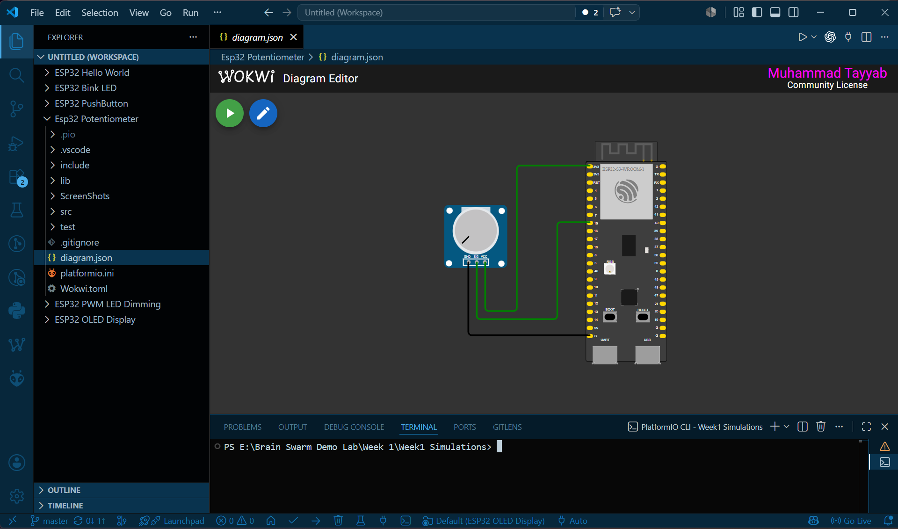
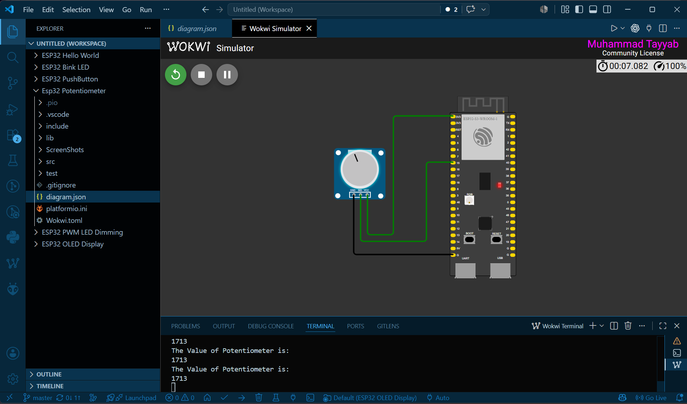

# ESP32 Potentiometer

This project demonstrates how to read analog values from a potentiometer using the ESP32's Analog-to-Digital Converter (ADC). Rotating the potentiometer changes the voltage supplied to the ESP32, which is displayed on the Serial Monitor.

---

## Components Required

- ESP32 Development Board
- Potentiometer (10kΩ)
- Jumper Wires
- Wokwi Simulator
- PlatformIO


## Concepts

### Potentiometer

A potentiometer is a variable resistor that produces different output voltages as its knob is rotated. It is commonly used to adjust brightness, volume, speed, and sensor thresholds.

---

### Analog Input

Unlike digital signals, analog signals can have many voltage levels between **0V** and **3.3V**.

The ESP32 measures these voltages using its **ADC (Analog-to-Digital Converter).**

---

### ADC (Analog-to-Digital Converter)

The ADC converts an analog voltage into a digital value that the ESP32 can process.

```cpp
analogRead(potPin);
```

Typical ADC values:

- 0 → 0V
- 4095 → 3.3V

---

### `analogRead()`

This function reads the voltage on an analog pin.

```cpp
int value = analogRead(4);
```

The returned value changes as the potentiometer rotates.

---

### Serial Monitor

The measured ADC value is displayed in the Serial Monitor.

```cpp
Serial.println(value);
```

This allows you to observe voltage changes in real time.

---

## Steps

1. Open the project in VS Code.
2. Build the project.
3. Start the Wokwi simulation.
4. Rotate the potentiometer.
5. Observe the changing ADC values in the Serial Monitor.

---

## Expected Output

### Circuit Diagram



### Simulation Output



As the potentiometer rotates:

- The output voltage changes.
- The ADC value changes between **0** and **4095**.
- The Serial Monitor continuously displays the updated readings.

---

## Project Structure

```
ESP32 Potentiometer/
├── src/
│   └── main.cpp
├── platformio.ini
├── diagram.json
├── wokwi.toml
├── images/
│   
└── README.md
```

---

## Learning Outcomes

After completing this project, you will understand:

- Analog signals
- Potentiometer operation
- ADC (Analog-to-Digital Converter)
- `analogRead()`
- Reading variable voltage levels
- Displaying sensor values using the Serial Monitor

---

## Author

**Muhammad Tayyab**
