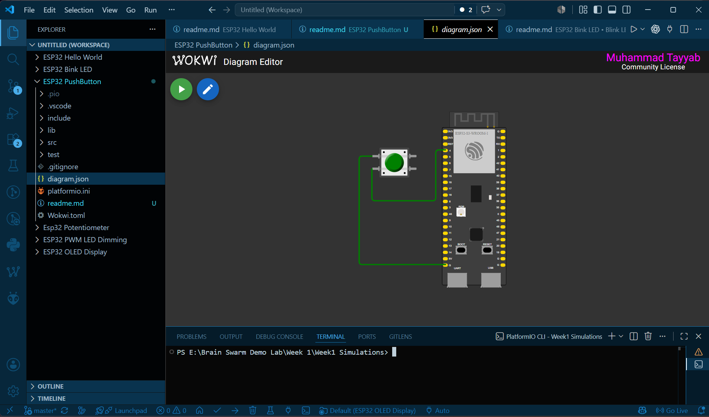
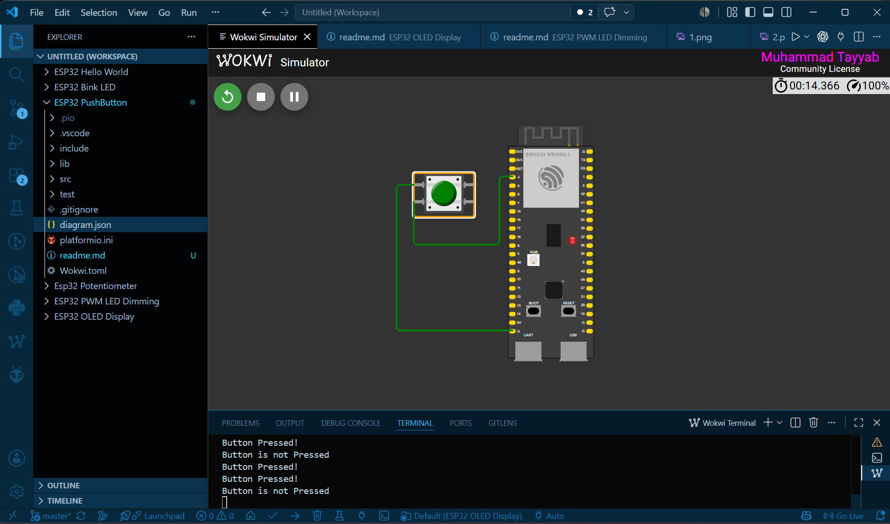

# ESP32 Push Button

This project demonstrates how to read the state of a push button using the ESP32. When the button is pressed, the ESP32 detects the input and performs the programmed action, such as turning an LED ON or printing a message to the Serial Monitor.

---

## Components Required

- ESP32 Development Board
- Push Button
- LED
- 220Ω Resistor
- Jumper Wires
- Wokwi Simulator
- PlatformIO


## Concepts

### Push Button

A push button is an input device that changes its electrical state when pressed. It allows users to interact with the ESP32.

---

### GPIO Input

GPIO pins can also be configured as **inputs** to read signals from external devices such as buttons, switches, and sensors.

```cpp
pinMode(buttonPin, INPUT_PULLUP);
```

---

### Internal Pull-up Resistor

The ESP32 contains built-in pull-up resistors.

Using:

```cpp
INPUT_PULLUP
```

keeps the input pin at **HIGH** when the button is not pressed. Pressing the button connects the pin to **GND**, making the input **LOW**.

This eliminates the need for an external pull-up resistor.

---

### `digitalRead()`

The `digitalRead()` function reads the current state of a digital input pin.

```cpp
digitalRead(buttonPin);
```

Possible values:

- HIGH → Button Released
- LOW → Button Pressed (using INPUT_PULLUP)

---

### Serial Monitor

The Serial Monitor helps display button states for debugging.

```cpp
Serial.println("Button Pressed");
```

---

## Steps

1. Open the project in VS Code.
2. Build the project using PlatformIO.
3. Start the Wokwi simulation.
4. Press and release the push button.
5. Observe the LED or Serial Monitor output.

---

## Expected Output

### Circuit Diagram



### Simulation Output



When the button is pressed:

- The ESP32 detects the input.
- The programmed action is executed.
- The Serial Monitor updates accordingly.

---

## Project Structure

```
ESP32 Push Button/
├── src/
│   └── main.cpp
├── platformio.ini
├── diagram.json
├── wokwi.toml
├── images/
│ 
└── README.md
```

---

## Learning Outcomes

After completing this project, you will understand:

- Digital input pins
- Push button operation
- Internal pull-up resistors
- `digitalRead()`
- Reading button states
- User input using ESP32

---

## Author

**Muhammad Tayyab**